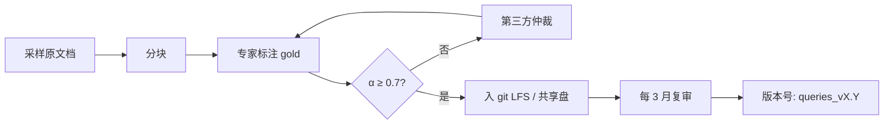

# 测试数据集设计（Test Datasets）

> 配套文档：[evaluation_plan.md](evaluation_plan.md) · [metrics_reference.md](metrics_reference.md)
> 目标：构造**可重复、可标注、覆盖典型 / 长尾 / 边界**的标准测试集。

---

## 1. 数据集组成

| 文件 | 用途 | 建议规模 |
| --- | --- | --- |
| `eval/datasets/eval_corpus.jsonl` | 评测语料（写入 Milvus） | ≥ 500 chunk |
| `eval/datasets/eval_queries.jsonl` | gold 标准 query | ≥ 200 条 |
| `eval/datasets/eval_queries_holdout.jsonl` | 留出集（防过拟合） | ≥ 50 条 |
| `eval/datasets/negative_queries.jsonl` | 负样本（库中无答案） | ≥ 30 条 |
| `eval/datasets/adversarial_queries.jsonl` | 对抗用例 | ≥ 20 条 |

---

## 2. 语料构造（eval_corpus.jsonl）

### 2.1 来源

> **必须与生产数据脱敏等价**：不直接用 `docs/GMP/**/*.docx`，避免和 Dify 真实索引污染。

- 从 `docs/GMP/SOP/`、`docs/GMP/SMP/` 中**抽取 10–15 份**代表性 SOP/SMP
- 用 `python-docx` 抽取正文 + 表格 → 按以下规则**合成** chunks

### 2.2 分块规则（建议）

| 参数 | 值 | 说明 |
| --- | --- | --- |
| `chunk_size` | 400 字符 | 适配 bge-large-zh-v1.5 的 512 token 限制 |
| `chunk_overlap` | 80 字符 | 20% |
| `splitter` | 句末标号 + 段落标题双锚点 | 避免切断条款编号 |

### 2.3 chunk schema

```json
{
  "chunk_id": "SOPQC-YL003-3-03::p3::c1",
  "doc_id": "SOPQC-YL003-3-03",
  "title": "地氯雷他定检验标准操作规程",
  "subject": "QC/原料检验",
  "content": "1. 目的：建立地氯雷他定原料的检验标准操作规程……",
  "metadata": {
    "doc_no": "SOPQC-YL003-3-03",
    "rev": "3",
    "effective_date": "2025-03-01",
    "dept": "QC",
    "category": "SOP"
  }
}
```

### 2.4 覆盖要求

| 类别 | 占比 | 数量（500 chunk） |
| --- | --- | --- |
| SOP（标准操作规程） | 60% | 300 |
| SMP（标准管理规程） | 25% | 125 |
| 记录表格 / 附录 | 10% | 50 |
| 异常 / 边缘 chunk（短 / 长 / 多语言） | 5% | 25 |

---

## 3. Query 构造（eval_queries.jsonl）

### 3.1 分类与配额

| 类型 | 说明 | 数量 | 难度 |
| --- | --- | --- | --- |
| **Factual** | 问具体事实：编号 / 部门 / 日期 | 40 | easy |
| **Procedural** | 问流程：怎么做 / 步骤 | 50 | medium |
| **Definitional** | 问定义 / 概念 / 缩写 | 30 | easy |
| **Numerical** | 问数值 / 限值 / 范围 | 25 | medium |
| **Comparison** | 跨文档对比 | 15 | hard |
| **Long-tail** | 极低频 / 专有名词 | 20 | hard |
| **Multi-hop** | 需多 chunk 拼接 | 15 | hard |
| **Adversarial** | 错别字 / 拼音 / 中英混排 | 20 | hard |
| **Negative** | 库中无答案 | 30 | medium |

> **比例建议**：easy 35%，medium 40%，hard 25%。

### 3.2 Query 模板

#### Factual

```text
{SOP标题} 的版本号是多少？
{SOP标题} 起草部门是哪个？
{SOP标题} 的生效日期？
```

#### Procedural

```text
{设备名} 清洁的标准操作流程是什么？
{产品名} 中间产品的检验步骤？
{设备名} 出现 {异常} 时如何处理？
```

#### Definitional

```text
什么是 SOP？SMP 与 SOP 的区别？
什么叫 "OOS"？本厂 OOS 处理流程？
```

#### Numerical

```text
{产品名} 中 {杂质} 的限度？
{设备} 运行时 {参数} 的合格范围？
```

#### Comparison

```text
{SOP_A} 与 {SOP_B} 在 {方面} 上有什么差异？
新旧两版 {SOP} 的关键变化？
```

#### Long-tail

```text
{极小众化学名} 的检验要点？
{罕见设备型号} 的标准操作？
```

#### Multi-hop

```text
{设备} 清洁后由谁复核？复核频次？
{产品} 出现 OOS 后，QA、QC 各自的动作？
```

#### Adversarial

```text
[错字] 二痒化硫残留量测定方法？
[拼音] er yang hua liu can liu liang ce ding fa
[EN] SOP for HPLC calibration in 中文
```

#### Negative

```text
本厂 ERP 系统使用什么数据库？
{公司} 2024 年的销售额？
本厂班车时刻表？
```

### 3.3 Query schema

```json
{
  "query_id": "q_0001",
  "query": "地氯雷他定检验标准操作规程的版本号是多少？",
  "type": "factual",
  "difficulty": "easy",
  "gold_chunks": [
    { "chunk_id": "SOPQC-YL003-3-03::p1::c1", "relevance": 3 },
    { "chunk_id": "SOPQC-YL003-3-03::p1::c2", "relevance": 2 }
  ],
  "expected_answer_keywords": ["SOPQC-YL003", "3", "版本"],
  "expected_doc_ids": ["SOPQC-YL003-3-03"],
  "must_include_metadata": { "doc_no": "SOPQC-YL003-3-03" },
  "is_negative": false,
  "notes": "询问文档元数据中的版本字段"
}
```

### 3.4 标注规范

| 等级 | 含义 | 标注要求 |
| --- | --- | --- |
| 3 | 直接、完整回答 query | 唯一 / 首选 |
| 2 | 部分回答 | 候选 |
| 1 | 提及但非完整回答 | 仅作辅助 |
| 0 | 不相关 | 不可作为 gold |

> **一致性要求**：≥ 2 名 SOP 专家独立标注，Krippendorff's α ≥ 0.7；不一致的由第 3 方仲裁。

### 3.5 留出与防泄漏

- `eval_queries_holdout.jsonl` 永远不参与调参
- 每次发版只**公布**训练集指标，留出集指标作为"真实泛化能力"
- 留出集每 3 个月重抽一次

---

## 4. 负样本（negative_queries.jsonl）

构造原则：

1. **领域内但库中无**：GMP 相关但本厂 SOP 未涵盖
2. **跨领域**：与 GMP 无关（财经、娱乐、生活）
3. **诱导式**：与库中文档**形似**但实际是另一回事

每条负样本需要：

```json
{
  "query_id": "neg_001",
  "query": "本厂班车时刻表",
  "expected_no_relevant_chunks": true,
  "trap_keywords": ["厂区", "时刻", "通勤"],
  "notes": "形似人事相关，但本知识库无此类文档"
}
```

> 用于验证：检索 top-K **不应**返回高相关结果（避免幻觉式命中）。

---

## 5. 对抗样本（adversarial_queries.jsonl）

| 类别 | 样例 |
| --- | --- |
| 错别字 | "二痒化硫残留量测定方法" |
| 同音字 | "二氧化硫残溜量" |
| 拼音 | "er yang hua liu ce ding" |
| 英文 | "HPLC calibration SOP" |
| 缩写 | "SOP 与 SMP 的差别" |
| 长 query（> 100 字） | 一段操作描述 + 隐含问题 |
| 极短 query | "包衣机" |
| 重复 token | "什么是 SOP 什么是 SOP" |

---

## 6. 维护流程



### 6.1 版本号规则

- `eval_queries_v1.0`：初版
- `eval_queries_v1.1`：新增 10 条
- `eval_queries_v2.0`：重做标注、调整分类

每次变更写入 `eval/datasets/CHANGELOG.md`，并在评估报告中引用。

---

## 7. 自动化生成脚本（占位）

```python
# eval/datasets/build_corpus.py
import json, uuid
from docx import Document

def docx_to_chunks(path: str, doc_id: str) -> list[dict]:
    doc = Document(path)
    paras = [p.text for p in doc.paragraphs if p.text.strip()]
    chunks, buf, idx = [], [], 0
    for p in paras:
        if sum(len(x) for x in buf) + len(p) > 400 and buf:
            chunks.append({
                "chunk_id": f"{doc_id}::c{idx}",
                "content": "\n".join(buf),
                "doc_id": doc_id,
            })
            idx += 1
            buf = buf[-2:]  # overlap
        buf.append(p)
    if buf:
        chunks.append({"chunk_id": f"{doc_id}::c{idx}", "content": "\n".join(buf), "doc_id": doc_id})
    return chunks
```

> 实际脚本放到 `eval/datasets/`，**不入 git**（仅结果入 git）。

---

## 8. 验收清单（DoD）

- [ ] `eval_corpus.jsonl` ≥ 500 chunk，覆盖 SOP/SMP/附录
- [ ] `eval_queries.jsonl` ≥ 200 条，类型比例符合 §3.1
- [ ] 标注一致性 α ≥ 0.7
- [ ] 负样本 ≥ 30 条
- [ ] 对抗样本 ≥ 20 条
- [ ] 留出集 ≥ 50 条
- [ ] 所有文件写入 git 后 commit 标签 `eval-data-v1.0`
